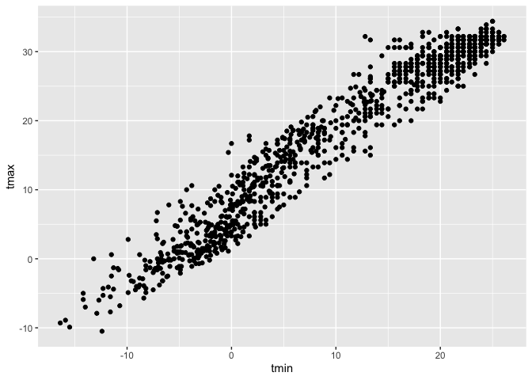
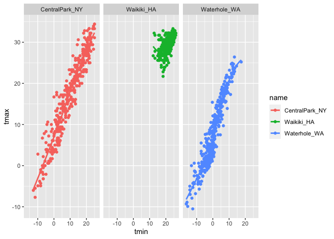
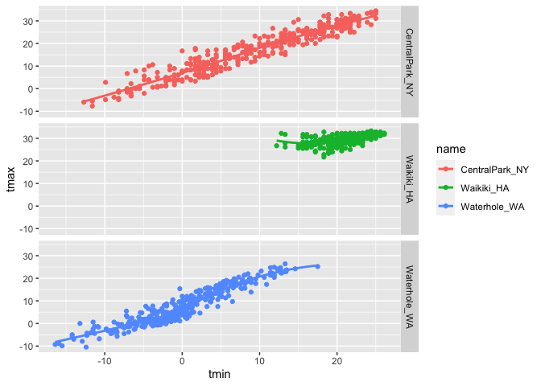
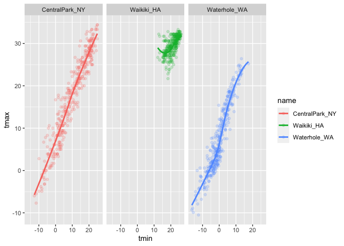
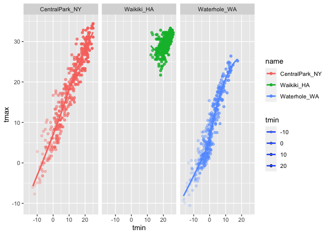

Visualization I
================
Shunyi Zhang

``` r
library(tidyverse)
```

    ## ── Attaching packages ──────────────────────────────────────────────────────────────────────────── tidyverse 1.3.0 ──

    ## ✓ ggplot2 3.3.2     ✓ purrr   0.3.4
    ## ✓ tibble  3.0.3     ✓ dplyr   1.0.2
    ## ✓ tidyr   1.1.2     ✓ stringr 1.4.0
    ## ✓ readr   1.3.1     ✓ forcats 0.5.0

    ## ── Conflicts ─────────────────────────────────────────────────────────────────────────────── tidyverse_conflicts() ──
    ## x dplyr::filter() masks stats::filter()
    ## x dplyr::lag()    masks stats::lag()

``` r
library(ggridges)
```

## Load the Weather Data

``` r
weather_df = 
  rnoaa::meteo_pull_monitors(
    c("USW00094728", "USC00519397", "USS0023B17S"),
    var = c("PRCP", "TMIN", "TMAX"),
    date_min = "2017-01-01",
    date_max = "2017-12-31"
  ) %>% 
  mutate(
    name = recode(
      id,
      USW00094728 = "CentralPark_NY",
      USC00519397 = "Waikiki_HA",
      USS0023B17S = "Waterhole_WA"
    ),
    tmin = tmin / 10,
    tmax = tmax / 10
  ) %>% 
  select(name, id, everything())
```

    ## Registered S3 method overwritten by 'hoardr':
    ##   method           from
    ##   print.cache_info httr

    ## using cached file: /Users/shane/Library/Caches/R/noaa_ghcnd/USW00094728.dly

    ## date created (size, mb): 2020-09-30 21:52:54 (7.52)

    ## file min/max dates: 1869-01-01 / 2020-09-30

    ## using cached file: /Users/shane/Library/Caches/R/noaa_ghcnd/USC00519397.dly

    ## date created (size, mb): 2020-09-30 21:52:59 (1.699)

    ## file min/max dates: 1965-01-01 / 2020-03-31

    ## using cached file: /Users/shane/Library/Caches/R/noaa_ghcnd/USS0023B17S.dly

    ## date created (size, mb): 2020-09-30 21:53:02 (0.877)

    ## file min/max dates: 1999-09-01 / 2020-09-30

``` r
head(weather_df)
```

    ## # A tibble: 6 x 6
    ##   name           id          date        prcp  tmax  tmin
    ##   <chr>          <chr>       <date>     <dbl> <dbl> <dbl>
    ## 1 CentralPark_NY USW00094728 2017-01-01     0   8.9   4.4
    ## 2 CentralPark_NY USW00094728 2017-01-02    53   5     2.8
    ## 3 CentralPark_NY USW00094728 2017-01-03   147   6.1   3.9
    ## 4 CentralPark_NY USW00094728 2017-01-04     0  11.1   1.1
    ## 5 CentralPark_NY USW00094728 2017-01-05     0   1.1  -2.7
    ## 6 CentralPark_NY USW00094728 2017-01-06    13   0.6  -3.8

## Basic Scatterplots

### Create forst scatterplot.

``` r
ggplot(weather_df, aes(x = tmin, y = tmax)) + 
  geom_point()
```

    ## Warning: Removed 15 rows containing missing values (geom_point).

<!-- -->

### Another approach. (fit overall syntax)

``` r
weather_df %>% 
  ggplot(aes(x = tmin, y = tmax)) + 
  geom_point()
```

    ## Warning: Removed 15 rows containing missing values (geom_point).

<!-- -->

### Save and edit a plot object. (least frequently)

``` r
weather_plot = 
  weather_df %>% 
  ggplot(aes(x = tmin, y = tmax))

weather_plot + geom_point()
```

    ## Warning: Removed 15 rows containing missing values (geom_point).

<!-- -->

## Advanced Scatterplots

### Make basics fancy

``` r
weather_df %>% 
  ggplot(aes(x = tmin, y = tmax, color = name)) + ##define another aesthetic mapping "color"
  geom_point() + 
  geom_smooth(se = FALSE) ##new geometry: geom_smooth, se = standard error, generally turnned off
```

    ## `geom_smooth()` using method = 'loess' and formula 'y ~ x'

    ## Warning: Removed 15 rows containing non-finite values (stat_smooth).

    ## Warning: Removed 15 rows containing missing values (geom_point).

<!-- -->

``` r
##`color = name` in ggplot() generate separate lines for each of 3 name factor. 
```

### About the ‘aes’ replacement

``` r
weather_df %>% 
  ggplot(aes(x = tmin, y = tmax)) + 
  geom_point(aes(color = name)) +
  geom_smooth() 
```

    ## `geom_smooth()` using method = 'gam' and formula 'y ~ s(x, bs = "cs")'

    ## Warning: Removed 15 rows containing non-finite values (stat_smooth).

    ## Warning: Removed 15 rows containing missing values (geom_point).

<!-- -->

``` r
##`color = name` inn geom_point() generate one single blue line running through all
```

### Facet

``` r
weather_df %>% 
  ggplot(aes(x = tmin, y = tmax, color = name)) + 
  geom_point() + 
  geom_smooth(se = FALSE) +
  facet_grid(. ~ name) ##a multi-planel plot
```

    ## `geom_smooth()` using method = 'loess' and formula 'y ~ x'

    ## Warning: Removed 15 rows containing non-finite values (stat_smooth).

    ## Warning: Removed 15 rows containing missing values (geom_point).

<!-- --> `.
~name`, `.`means don’t create rows, `name` defines columns. `~` called
tilde.

``` r
weather_df %>% 
  ggplot(aes(x = tmin, y = tmax, color = name)) + 
  geom_point() + 
  geom_smooth(se = FALSE) +
  facet_grid(name ~ .)
```

    ## `geom_smooth()` using method = 'loess' and formula 'y ~ x'

    ## Warning: Removed 15 rows containing non-finite values (stat_smooth).

    ## Warning: Removed 15 rows containing missing values (geom_point).

<!-- --> the
reverse for the previous one.

``` r
weather_df %>% 
  ggplot(aes(x = tmin, y = tmax, color = name)) + 
  geom_point(alpha = .2) +      ##alpha level for transparency
  geom_smooth(se = FALSE) +
  facet_grid(. ~ name)
```

    ## `geom_smooth()` using method = 'loess' and formula 'y ~ x'

    ## Warning: Removed 15 rows containing non-finite values (stat_smooth).

    ## Warning: Removed 15 rows containing missing values (geom_point).

<!-- -->

``` r
weather_df %>% 
  ggplot(aes(x = tmin, y = tmax, alpha = tmin, color = name)) + 
  ##alpha level be related to the precipitation variable
  geom_point() +      
  geom_smooth(se = FALSE) +
  facet_grid(. ~ name)
```

    ## `geom_smooth()` using method = 'loess' and formula 'y ~ x'

    ## Warning: Removed 15 rows containing non-finite values (stat_smooth).

    ## Warning: Removed 15 rows containing missing values (geom_point).

<!-- -->

### Combine elements

``` r
weather_df %>% 
  ggplot(aes(x = date, y = tmax, color = name)) + 
  geom_point(aes(size = prcp), alpha = 0.5) + 
  geom_smooth(se = FALSE) + 
  facet_grid(. ~ name)
```

    ## `geom_smooth()` using method = 'loess' and formula 'y ~ x'

    ## Warning: Removed 3 rows containing non-finite values (stat_smooth).

    ## Warning: Removed 3 rows containing missing values (geom_point).

<!-- -->

### Small Notes

``` r
weather_df %>% 
  ggplot(aes(x = tmin, y = tmax, color = name)) + 
  geom_smooth(se = FALSE)
```

    ## `geom_smooth()` using method = 'loess' and formula 'y ~ x'

    ## Warning: Removed 15 rows containing non-finite values (stat_smooth).

<!-- -->

``` r
weather_df %>% 
  ggplot(aes(x = tmin, y = tmax)) + 
  geom_hex() +
  geom_density2d()
```

    ## Warning: Removed 15 rows containing non-finite values (stat_binhex).

    ## Warning: Removed 15 rows containing non-finite values (stat_density2d).

<!-- -->

## Univariate plots

### Histograms

``` r
weather_df %>% 
  ggplot(aes(x = tmin)) + 
  geom_histogram()
```

    ## `stat_bin()` using `bins = 30`. Pick better value with `binwidth`.

    ## Warning: Removed 15 rows containing non-finite values (stat_bin).

<!-- -->

``` r
weather_df %>% 
  ggplot(aes(x = tmin, fill = name)) + 
  geom_histogram() + ##option: (position = "dodge")
  facet_grid(. ~ name) ##don't need color or fill b/c separate plots
```

    ## `stat_bin()` using `bins = 30`. Pick better value with `binwidth`.

    ## Warning: Removed 15 rows containing non-finite values (stat_bin).

<!-- -->

``` r
weather_df %>% 
  ggplot(aes(x = tmin, fill = name)) + 
  geom_density(alpha = .3)
```

    ## Warning: Removed 15 rows containing non-finite values (stat_density).

%60-1.png)<!-- -->

### Boxplot

``` r
weather_df %>% 
  ggplot(aes(x = name, y = tmin)) +
  geom_boxplot()
```

    ## Warning: Removed 15 rows containing non-finite values (stat_boxplot).

<!-- -->

### Trendy plot

``` r
weather_df %>% 
  ggplot(aes(x =name, y = tmin, fill = name)) +
  geom_violin(alpha = .5) + ##cross between boxplot and density plot 
  stat_summary(fun = "median")
```

    ## Warning: Removed 15 rows containing non-finite values (stat_ydensity).

    ## Warning: Removed 15 rows containing non-finite values (stat_summary).

    ## Warning: Removed 3 rows containing missing values (geom_segment).

<!-- -->

### Ridge plot – most popular in 2017

``` r
weather_df %>% 
  ggplot(aes(x = tmin, y = name)) +
  geom_density_ridges()
```

    ## Picking joint bandwidth of 1.67

    ## Warning: Removed 15 rows containing non-finite values (stat_density_ridges).

<!-- -->
