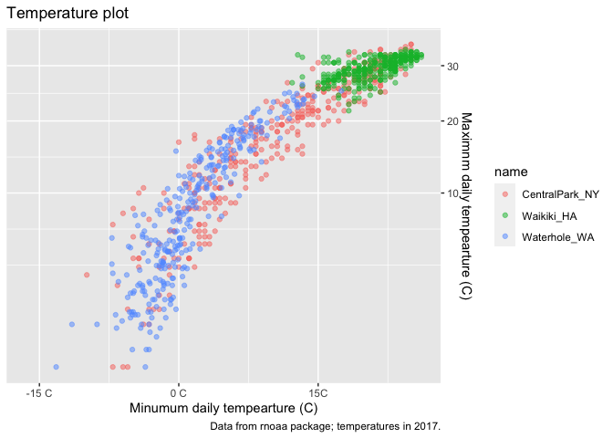

Visualization
================
Shunyi Zhang

``` r
library(tidyverse)
```

    ## ── Attaching packages ──────────────────────────────────────────────────────────────────────────── tidyverse 1.3.0 ──

    ## ✓ ggplot2 3.3.2     ✓ purrr   0.3.4
    ## ✓ tibble  3.0.3     ✓ dplyr   1.0.2
    ## ✓ tidyr   1.1.2     ✓ stringr 1.4.0
    ## ✓ readr   1.3.1     ✓ forcats 0.5.0

    ## ── Conflicts ─────────────────────────────────────────────────────────────────────────────── tidyverse_conflicts() ──
    ## x dplyr::filter() masks stats::filter()
    ## x dplyr::lag()    masks stats::lag()

``` r
library(patchwork)
```

``` r
weather_df = 
  rnoaa::meteo_pull_monitors(
    c("USW00094728", "USC00519397", "USS0023B17S"),
    var = c("PRCP", "TMIN", "TMAX"),
    date_min = "2017-01-01",
    date_max = "2017-12-31"
  ) %>% 
  mutate(
    name = recode(
      id,
      USW00094728 = "CentralPark_NY",
      USC00519397 = "Waikiki_HA",
      USS0023B17S = "Waterhole_WA"
    ),
    tmin = tmin / 10,
    tmax = tmax / 10
  ) %>% 
  select(name, id, everything())
```

    ## Registered S3 method overwritten by 'hoardr':
    ##   method           from
    ##   print.cache_info httr

    ## using cached file: /Users/shane/Library/Caches/R/noaa_ghcnd/USW00094728.dly

    ## date created (size, mb): 2020-09-30 21:52:54 (7.52)

    ## file min/max dates: 1869-01-01 / 2020-09-30

    ## using cached file: /Users/shane/Library/Caches/R/noaa_ghcnd/USC00519397.dly

    ## date created (size, mb): 2020-09-30 21:52:59 (1.699)

    ## file min/max dates: 1965-01-01 / 2020-03-31

    ## using cached file: /Users/shane/Library/Caches/R/noaa_ghcnd/USS0023B17S.dly

    ## date created (size, mb): 2020-09-30 21:53:02 (0.877)

    ## file min/max dates: 1999-09-01 / 2020-09-30

``` r
weather_df %>% 
  ggplot(aes(x = tmin, y = tmax, color = name)) +
  geom_point(alpha = .5)
```

    ## Warning: Removed 15 rows containing missing values (geom_point).

<!-- -->

## Labels

``` r
weather_df %>% 
  ggplot(aes(x = tmin, y = tmax, color = name)) +
  geom_point(alpha = .5) +
  labs(
    title = "Temperature plot",
    x = "Minumum daily tempearture (C)",
    y = "Maximnm daily tempearture (C)",
    caption = "Data from rnoaa package; temperatures in 2017."
  )
```

    ## Warning: Removed 15 rows containing missing values (geom_point).

<!-- -->

## Scales

### x and y scales

``` r
weather_df %>% 
  ggplot(aes(x = tmin, y = tmax, color = name)) +
  geom_point(alpha = .5) +
  labs(
    title = "Temperature plot",
    x = "Minumum daily tempearture (C)",
    y = "Maximnm daily tempearture (C)",
    caption = "Data from rnoaa package; temperatures in 2017."
  ) +
  scale_x_continuous(
    breaks = c(-15, 0, 15),
    labels = c("-15 C", "0 C", "15C")
  ) + 
  scale_y_continuous(
    trans = "sqrt", ##"log"
    position = "right"
  )
```

    ## Warning in self$trans$transform(x): NaNs produced

    ## Warning: Transformation introduced infinite values in continuous y-axis

    ## Warning: Removed 90 rows containing missing values (geom_point).

<!-- -->

### Color scale

``` r
weather_df %>% 
  ggplot(aes(x = tmin, y = tmax, color = name)) +
  geom_point(alpha = .5) +
  labs(
    title = "Temperature plot",
    x = "Minumum daily tempearture (C)",
    y = "Maximnm daily tempearture (C)",
    caption = "Data from rnoaa package; temperatures in 2017."
  ) +
  scale_color_hue(
    name = "Location",
    h = c(100,300))
```

    ## Warning: Removed 15 rows containing missing values (geom_point).

<!-- -->

### Different type of color scale

``` r
weather_df %>% 
  ggplot(aes(x = tmin, y = tmax, color = name)) +
  geom_point(alpha = .5) +
  labs(
    title = "Temperature plot",
    x = "Minumum daily tempearture (C)",
    y = "Maximnm daily tempearture (C)",
    caption = "Data from rnoaa package; temperatures in 2017."
  ) +
  viridis::scale_color_viridis(
    name = "Location",
    discrete = TRUE
  )
```

    ## Warning: Removed 15 rows containing missing values (geom_point).

<!-- -->

## Themes

``` r
weather_df %>% 
  ggplot(aes(x = tmin, y = tmax, color = name)) +
  geom_point(alpha = .5) +
  labs(
    title = "Temperature plot",
    x = "Minumum daily tempearture (C)",
    y = "Maximnm daily tempearture (C)",
    caption = "Data from rnoaa package; temperatures in 2017."
  ) +
  viridis::scale_color_viridis(
    name = "Location",
    discrete = TRUE
  ) + 
  theme_bw() + ## black and white grid
  theme_minimal() + ##no box around the plot
  theme(
    legend.position = "bottom"
  ) ## whole lots of option for legend
```

    ## Warning: Removed 15 rows containing missing values (geom_point).

<!-- -->

``` r
weather_df %>% 
  ggplot(aes(x = tmin, y = tmax, color = name)) +
  geom_point(alpha = .5) +
  labs(
    title = "Temperature plot",
    x = "Minumum daily tempearture (C)",
    y = "Maximnm daily tempearture (C)",
    caption = "Data from rnoaa package; temperatures in 2017."
  ) +
  viridis::scale_color_viridis(
    name = "Location",
    discrete = TRUE
  ) + 
  theme_classic() ## no grid, old fashion
```

    ## Warning: Removed 15 rows containing missing values (geom_point).

<!-- -->

``` r
weather_df %>% 
  ggplot(aes(x = tmin, y = tmax, color = name)) +
  geom_point(alpha = .5) +
  labs(
    title = "Temperature plot",
    x = "Minumum daily tempearture (C)",
    y = "Maximnm daily tempearture (C)",
    caption = "Data from rnoaa package; temperatures in 2017."
  ) +
  viridis::scale_color_viridis(
    name = "Location",
    discrete = TRUE
  ) + 
  ggthemes::theme_economist() ##thats what the ceonomists looks like, there are a lot of other themes.
```

    ## Warning: Removed 15 rows containing missing values (geom_point).

<!-- -->

## Setting Options

``` r
library(tidyverse)

knitr::opts_chunk$set(
  fig.width = 6,
  fig.asp = 6,
  out.width = 90%
)

theme_set(theme_minimal() + theme(legend.position = "bottom"))

options(
  ggplot2.continuous.colour = "viridis",
  ggplot2.continuous.fill = "viridis"
)

scale_colour_discrete = scale_color_viridis_d
scale_fill_discrete = scale_fill_viridis_d
```

## Data Arg in `geom`

``` r
central_park =
  weather_df %>% 
  filter(name == "CentralPark_NY")

waikiki =
  weather_df %>% 
  filter(name == "Waikiki_HA")

ggplot(data = waikiki, aes(x = date, y = tmax, color = name)) + 
  geom_point() + 
  geom_line(data = central_park)
```

    ## Warning: Removed 3 rows containing missing values (geom_point).

<!-- -->
